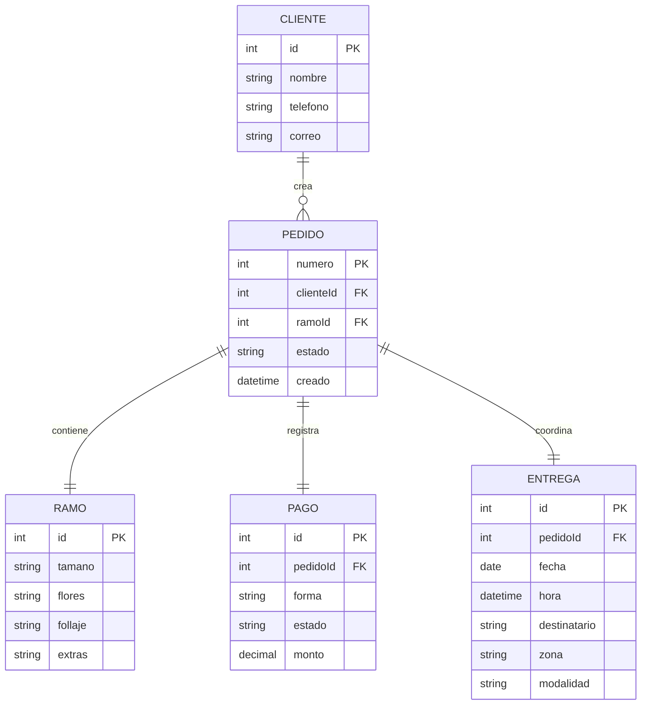
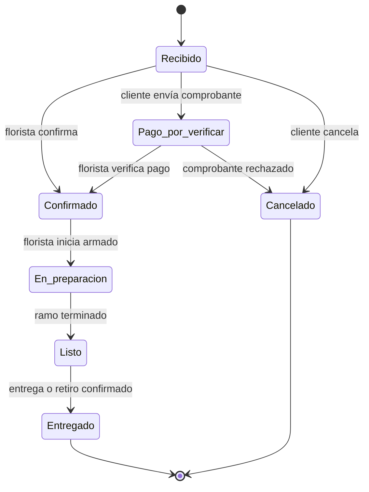

# Roses Lolas · ficha del negocio

**Integrantes:** Derek Josue Cedeño Soledispa y Henrry Josue Demera Pincay  
**Producto:** Roses Lolas, florería con armado y entrega de ramos a pedido en Manta.  
**Repositorio:** [clienteB-cede-o-soledispa](https://github.com/derekced/clienteB-cede-o-soledispa)

## 1. Negocio de referencia

Tomamos como referencia el modelo de **The Little Flower Shop**, una florería que permite elegir o configurar ramos desde su catálogo en línea. El producto principal es un ramo personalizado: el cliente combina flores, follaje, envoltura y complementos, selecciona una fecha de entrega y solicita el armado. El público son personas que necesitan enviar un regalo o comprar flores para una ocasión concreta sin visitar el local. La cobranza ocurre antes de preparar el pedido mediante los medios de pago que la tienda acepta en línea; la operación obtiene valor al convertir una selección digital en un ramo físico entregado a una persona y hora determinadas.

La fuente pública que usamos para observar el flujo de configuración es [The Little Flower Shop · Bouquet Builder](https://the-little-flowershop.co.uk/product-category/bouquet-builder/). Esa página muestra el catálogo y la lógica de personalización, pero no publica una cifra auditada de ingresos. Por eso no atribuimos una cifra inventada al fundador: para Roses Lolas la métrica que se comprobará en el prototipo será el número de pedidos confirmados y entregados, el valor de cada pedido y el porcentaje entregado a tiempo. Nuestra adaptación conserva el principio del referente, pero lo aterriza a pedidos locales y coordinación directa con la florista.

## 2. Caso de contraste

Como contraste usamos [Busy Bee Florist](https://news.google.com/search?q=%22Busy%20Bee%20Florist%20in%20Wisbech%20enters%20liquidation%22), un negocio comparable cuya entrada en liquidación después de siete años fue reportada por [Peterborough Telegraph](https://www.peterboroughtoday.co.uk/). El caso permite observar que una florería local puede tener ventas estacionales, costos fijos y obligaciones que vuelven frágil el margen cuando la demanda no alcanza. La fuente confirma la liquidación; no atribuye por sí sola una causa única.

La hipótesis de Roses Lolas es que la combinación de costos fijos, desperdicio de flores perecederas y entregas coordinadas manualmente pudo impedir que Busy Bee conservara margen en los periodos de menor demanda. Por eso nuestro primer alcance limita la cobertura a Manta, registra la zona y la hora de entrega, confirma disponibilidad antes de preparar y concentra los pedidos en una bandeja. La decisión busca reducir complejidad operativa antes de ampliar el negocio.

## 3. Adaptación al Ecuador

- **Transferencia y comprobante:** muchos clientes pagan por transferencia y envían una captura del comprobante. El pedido necesita registrar la forma de pago y reservar la confirmación antes de pasar a preparación.
- **Facturación y datos del comprador:** la florista debe poder solicitar los datos necesarios para comprobante o factura electrónica del SRI. Por eso el pedido conserva cliente, contacto y datos de entrega separados del detalle del ramo.
- **Cobertura y última milla en Manta:** la tarifa y el tiempo dependen de la zona, la distancia y si es entrega o retiro en local. La vista de la florista muestra destinatario y zona junto con la hora para ordenar el trabajo.
- **Disponibilidad variable de flores:** el inventario de flores cambia por temporada y proveedor. La confirmación queda bajo responsabilidad de la florista, que puede aceptar el pedido o contactar al cliente antes de prepararlo.

La restricción que cambió el modelo fue el pago por transferencia: añadimos el estado **pago por verificar** en la operación del pedido. En la implementación visible el flujo inicia en **Recibido** y la confirmación de la florista representa que el pedido y el pago ya fueron revisados; la siguiente iteración puede mostrar ese estado intermedio explícitamente en la tabla.

## 4. Modelo de datos

El producto usa cinco entidades para que el pedido no mezcle la persona, el ramo, el pago y la entrega en una sola estructura.

### Entidad: Cliente

| Atributo | Tipo | Obligatorio | Ejemplo |
| --- | --- | --- | --- |
| id | número entero | sí | 18 |
| nombre | texto | sí | Ana López |
| telefono | texto | sí | 0991234567 |
| correo | texto | no | ana@example.com |

### Entidad: Pedido

| Atributo | Tipo | Obligatorio | Ejemplo |
| --- | --- | --- | --- |
| numero | número entero | sí | 106 |
| clienteId | referencia a otra entidad | sí | 18 |
| ramoId | referencia a otra entidad | sí | 51 |
| estado | uno de: recibido, pago por verificar, confirmado, en preparación, listo, entregado, cancelado | sí | recibido |
| creado | fecha y hora | sí | 30-09-2026 09:20 |

### Entidad: Ramo

| Atributo | Tipo | Obligatorio | Ejemplo |
| --- | --- | --- | --- |
| id | número entero | sí | 51 |
| tamano | uno de: pequeño, mediano, grande | sí | mediano |
| flores | texto | sí | rosas rojas y eucalipto |
| follaje | texto | no | eucalipto |
| extras | texto | no | tarjeta |

### Entidad: Pago

| Atributo | Tipo | Obligatorio | Ejemplo |
| --- | --- | --- | --- |
| id | número entero | sí | 77 |
| pedidoId | referencia a otra entidad | sí | 106 |
| forma | uno de: transferencia bancaria, efectivo, tarjeta | sí | transferencia bancaria |
| estado | uno de: pendiente, por verificar, verificado, rechazado | sí | por verificar |
| monto | número decimal | sí | 22.50 |

### Entidad: Entrega

| Atributo | Tipo | Obligatorio | Ejemplo |
| --- | --- | --- | --- |
| id | número entero | sí | 90 |
| pedidoId | referencia a otra entidad | sí | 106 |
| fecha | fecha | sí | 30-09-2026 |
| hora | fecha y hora | sí | 30-09-2026 15:30 |
| destinatario | texto | sí | Carlos M. |
| zona | texto | sí | Tarqui |
| modalidad | uno de: entrega a domicilio, retiro en local | sí | entrega a domicilio |

### Relaciones

| Entidades | Cardinalidad | Regla del negocio |
| --- | --- | --- |
| Cliente · Pedido | 1:N | Un cliente puede crear muchos pedidos; cada pedido pertenece a un solo cliente. |
| Pedido · Ramo | 1:1 | Cada pedido contiene un ramo configurado; un ramo de este alcance pertenece a un pedido. |
| Pedido · Pago | 1:1 | Cada pedido tiene un registro de pago para confirmar antes de preparar. |
| Pedido · Entrega | 1:1 | Cada pedido tiene una fecha, hora y modalidad de entrega o retiro. |

### Diagrama completo

**Decisión discutible:** `Ramo` es una entidad y no un campo de texto dentro de `Pedido`, porque reúne varios componentes configurables y puede cambiar sin perder la identidad del pedido. Separar `Pago` y `Entrega` también evita mezclar dos estados diferentes: un pago puede estar por verificar mientras la entrega todavía no está lista para coordinarse.

## 5. Máquina de estados

### Estados del pedido

| Estado | Significado en el negocio |
| --- | --- |
| **Recibido (inicial)** | El cliente envió el pedido y la florista todavía debe revisarlo. |
| Pago por verificar | Se recibió una transferencia o comprobante pendiente de revisión. |
| Confirmado | La florista verificó disponibilidad, pago y datos de entrega. |
| En preparación | La florista está armando el ramo. |
| Listo | El ramo está terminado y espera entrega o retiro. |
| Entregado | El cliente o destinatario recibió el ramo. |
| Cancelado | El pedido no continuará y no se prepara. |

### Transiciones

| De | A | Quién la hace | Condición |
| --- | --- | --- | --- |
| Recibido | Pago por verificar | Cliente | El cliente seleccionó transferencia y envió el comprobante. |
| Recibido | Confirmado | Florista | Pago en efectivo o tarjeta, disponibilidad y datos correctos. |
| Pago por verificar | Confirmado | Florista | El comprobante coincide con el pedido y el ramo está disponible. |
| Pago por verificar | Cancelado | Florista | El comprobante no se puede validar o el cliente desiste. |
| Confirmado | En preparación | Florista | El pedido está pagado y llegó el momento de armarlo. |
| En preparación | Listo | Florista | El ramo coincide con la configuración y está terminado. |
| Listo | Entregado | Florista | Se realizó la entrega o el retiro en local. |
| Recibido | Cancelado | Cliente | El pedido todavía no fue confirmado. |

### Diagrama de estados

**Transición prohibida:** no se permite pasar de **Entregado** a **En preparación**. Si el cliente reporta un problema después de la entrega, se registra una incidencia o un pedido nuevo que cita al anterior; reabrir el pedido original falsearía el tiempo de entrega y el historial de la florista.

## 6. Roles y permisos

| Acción | Cliente comprador | Florista |
| --- | --- | --- |
| Ver pedidos | Solo los suyos | Todos |
| Configurar ramo | Sí, en sus pedidos | No cambia la configuración solicitada |
| Crear pedido | Sí | No |
| Adjuntar comprobante | Solo los suyos | Puede consultar |
| Ver datos de entrega | Solo los suyos | Todos los pedidos |
| Confirmar pago y pedido | No | Sí, todos |
| Cambiar estado de preparación | No | Sí, todos |
| Cancelar pedido recibido | Solo los suyos | Sí, todos |
| Marcar entrega | No | Sí, todos |

La florista necesita alcance **todos** para ordenar su jornada y cambiar transiciones operativas. El cliente tiene alcance **solo los suyos** para proteger datos personales y evitar que modifique pedidos de otra persona.

## 7. Mapa de vistas por rol

| Vista | Rol | Datos que muestra | Acciones | Cómo muestra el estado |
| --- | --- | --- | --- | --- |
| Mis pedidos | Cliente comprador | Sus pedidos, ramo, entrega y pago | Abrir detalle, cancelar si está recibido | Palabra visible: Recibido, Confirmado o Entregado |
| Nuevo pedido | Cliente comprador | Configuración del ramo, fecha, hora, zona y pago | Crear pedido | Mensaje de confirmación: pedido en estado Recibido |
| Bandeja de pedidos por preparar | Florista | Número, entrega, ramo, destinatario/zona y estado de todos los pedidos | Priorizar y abrir un pedido | Estado escrito como palabra en cada fila |
| Detalle del pedido | Cliente comprador y Florista | Cliente, componentes del ramo, pago y entrega | Consultar; la florista puede avanzar el estado | Historial y estado actual en texto |
| Cambio de estado | Florista | Pedido seleccionado y transiciones permitidas | Confirmar pago, iniciar preparación, marcar listo o entregado | Selector o acción etiquetada con el siguiente estado |

La vista **Bandeja de pedidos por preparar** y la vista **Nuevo pedido** ya están maquetadas en [src/App.svelte](../src/App.svelte) y [src/Formulario.svelte](../src/Formulario.svelte). La tabla conserva el estado como texto y se desplaza dentro de su propio espacio en pantallas estrechas, según la decisión documentada en [docs/decisiones.md](decisiones.md).

## 8. Declaración de IA

Se usó GitHub Copilot para revisar la redacción, completar la estructura del Hito 1, proponer tablas y diagramas a partir del dominio ya definido y preparar la presentación. Las decisiones del negocio, las entidades, los estados y los permisos fueron proporcionados y revisados por la pareja.